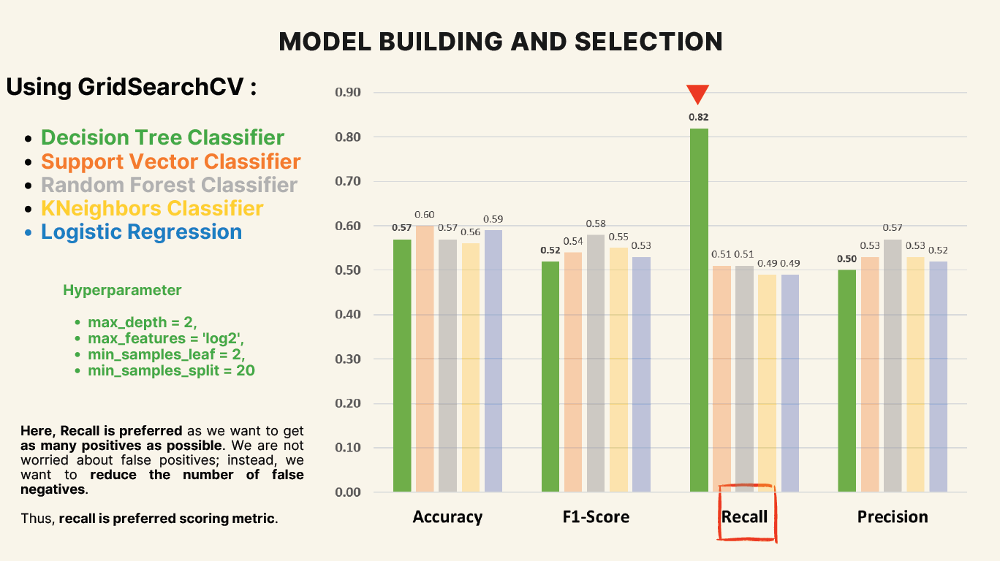
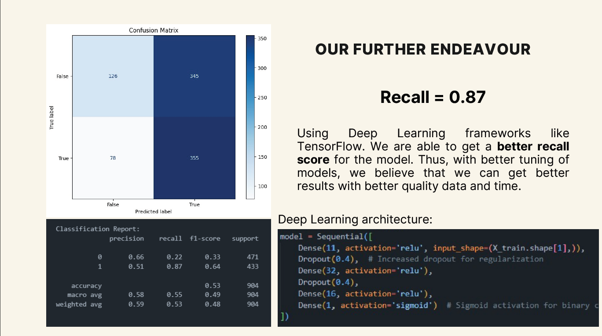

# Axiata Digital Certifications Program 
## Cohort 2/2024 Capstone Project: Target Market Analysis

For this capstone project, we were provided with a dataset of customer purchases, which included the amount of money spent, the number of inactive months, and other details.

## Objective
1. Design a predictive model to determine the potential customers who will purchase a product for the company to send advertisements based on available data.
2. Compare the predictive model's performance against a default option of sending the advertisement to everyone. Given;
   - The cost of sending 1 advertisement is **RM5.00**
   - Average purchase is **RM14.56**

## Findings
Our decision tree model shows **better performance** than the default option in a larger scale of customers, with a marginal difference in smaller groups of customers. The model achieved a recall value of **82%**.

> Recall is preferred as we want to get as many positives as possible. We are not worried about false positives; instead, we want to reduce the number of false negatives. Thus, **recall is the preferred scoring metric**.

Large Sample - 30,000 Customers
|   |Predictive Model|Default Option|
|---|---|---|
|**Revenue** |RM21,880.00| -RM106,182.94 |

Small Sample - 3,000 Customers

|   |Predictive Model|Default Option|
|---|---|---|
|**Revenue** |RM1,660.02| RM1693.25 |

## Algorithms
- Decision Tree Classifier
- Support Vector Classifier
- Random Forest Classifier
- KNeighbors Classifier
- Logistic Regression

Deep learning was done as well and was able to achieve **87%** recall.

## Data Description

# Acknowledgements
Teammates for the completion of this capstone project
- Raja Zareef Firdaus Bin Raja Azman Nahar
- Nur Farhanah Roslan
- Samuel Low Yu Huang
- Kang Ming Xuan

Centre of Applied Data Science for organizing this program

Axiata for sponsoring
